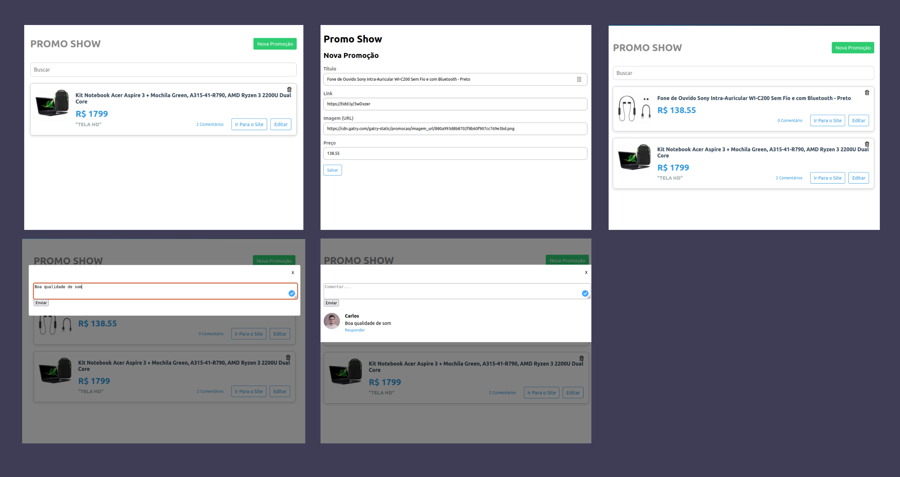

# PromoCart

- Aplicação refeita para estudos em ReactJS
- Sistema que permite o usuário cadastrar, editar e fazer comentários sobre alguma promoção de produtos.

## Pré-requisitos
- git
- node
- npm ou yarn

## Dependências usadas


 - [Axios](https://www.npmjs.com/package/axios)
 - [Formik](https://www.npmjs.com/package/formik)
 - [yup](https://www.npmjs.com/package/yup)

  
## Instalação
```bash
git clone https://github.com/FernandoCMF/PromoCart.git
```

```bash
  cd PromoCart
  npm install //Para instalar as dependências
  npm start
```
    
## Screenshots


## Autor
- [@Vicicius Dacal](https://github.com/viniciusdacal)
